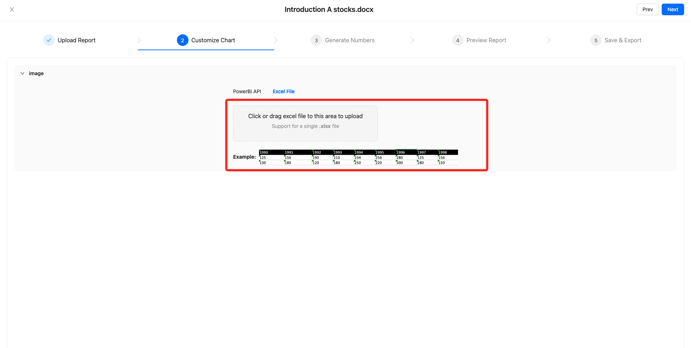
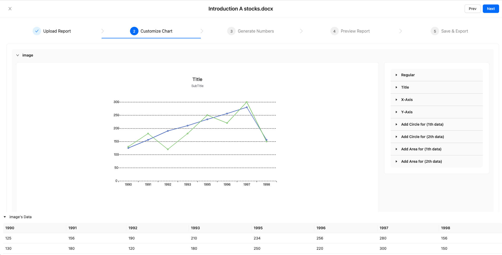

## Doc Processor Code Component
This is a code component that processes doc documents and provides the following features:

- Configures [charts](https://echarts.apache.org/zh/index.html)
- Replaces variables `{variable}` in the doc document with corresponding text
- Replaces placeholders for charts `{%chartA}` in the doc document with corresponding chart images.

For more detailed information about this code component, please refer to the `code component` documentation of `PowerApps`

### Demo
1. Set open to `true`

2. Upload `doc` file (not real upload to remote)

3. Upload `xlsx` file as `chart` data

4. Configure chart

4. Enter the text content to be replaced with the doc text placeholder

5. Preview final `doc` report

6. Export `doc` report

### Setup
To set up this code component, follow these steps:

Install the required dependencies by running `npm install`.
Start the development server by running `npm run start`.

### Docs file
There are two files located in the `docs/` directory: one is a `docx` file for testing document upload, and the other is an `xlsx` file containing custom chart images.

### Build

To build this code component, follow these steps:

- In the root directory, run `npm run build && pac pcf push --publisher-prefix yourprefixname` to build and publish the code component in development mode.
- In the `DocProcessorComponent/` directory, run `dotnet msbuild /t:Build /p:Configuration=Release` to build the code component for production.
  

Please note that building the code component for production requires running a command in a specific directory.